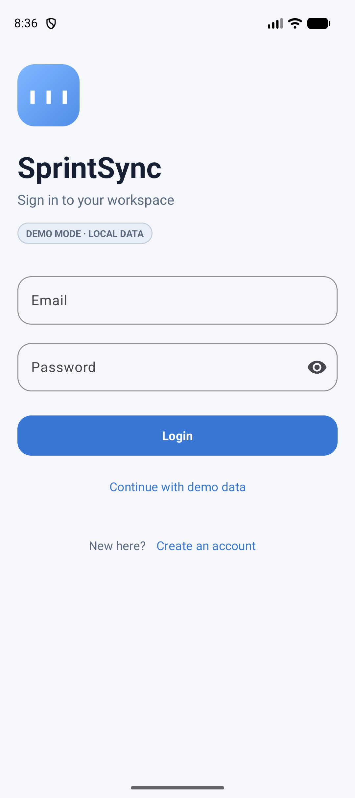
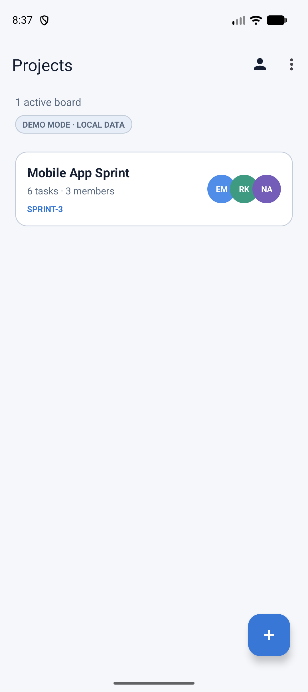
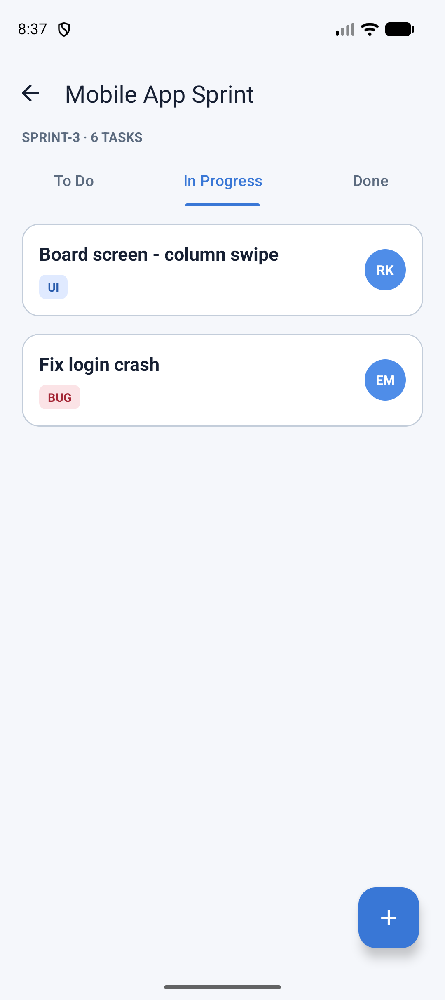
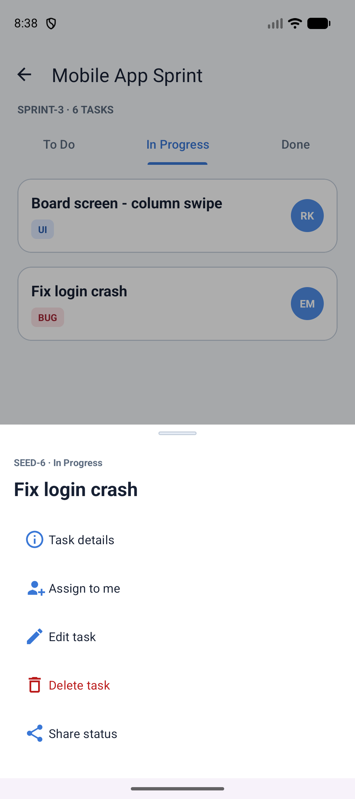
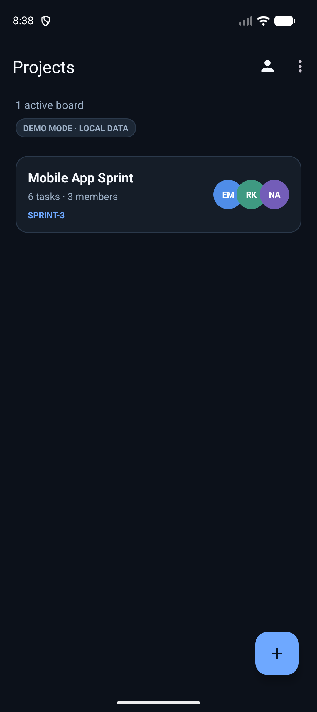

# SprintSync

SprintSync is a focused Kanban app for small development teams and software
engineering students. It keeps projects, tasks, assignees, and sprint status in
one fast Android experience without the complexity of enterprise project
management tools.

## Screenshots

Captured in Demo Mode, so everything shown here is what a fresh clone produces
with no configuration.

| Sign in | Projects | Board |
| --- | --- | --- |
|  |  |  |

| Task options | Projects, dark theme |
| --- | --- |
|  |  |

## Highlights

- Email/password registration and sign-in with Firebase Authentication.
- Real-time project and task updates with Firebase Realtime Database, verified
  across two accounts on two devices.
- Team boards with `To Do`, `In Progress`, and `Done` columns.
- `TabLayout` + `ViewPager2` navigation, with one `Fragment` per status.
- View, edit, delete, assign, and share a task from a bottom sheet; task details
  open as a fragment on the back stack.
- A "last synced" indicator on the board, so an idle live board is distinguishable
  from a silently disconnected one.
- Avatar selection and upload to Firebase Storage; Glide image loading.
- Presentation-safe local demo mode backed by SharedPreferences + Gson.
- English and Hebrew, with an in-app language switcher, full RTL, and correct
  Hebrew plural forms including the dual.
- Theme that follows the system by default, with a light/dark override.
- Modern edge-to-edge inset handling and accessible touch targets.

## Demo Mode and Firebase Mode

**A fresh clone runs with zero configuration.** `local.properties` is gitignored, so
a new checkout has no Firebase values, `FirebaseBootstrap` returns `null`, and
`RepositoryProvider` selects the local repository. Every screen stays fully
interactive against a seeded `SharedPreferences` database. That is deliberate: a
classroom demo should not depend on Wi-Fi or on somebody else's Firebase project.

A badge on the login, register and projects screens always says which mode is live —
`DEMO MODE · LOCAL DATA` or `LIVE · FIREBASE SYNC`.

### Signing in to Demo Mode

Use any email and any password, or tap **Continue with demo data**.

That is not a typo. Demo Mode's `signIn` accepts any password and creates a user for
any address it has not seen before. It is a presentation fallback rather than an
authentication system, and it says nothing about the Firebase path, which uses real
Firebase Authentication. Signing in as `ehab@sprintsync.dev` gets you the seeded
board — *Mobile App Sprint*, six tasks across three columns; any other address starts
with an empty board list.

## Architecture

```text
Activities / Fragments
        │
        ▼
BoardViewModel + adapters + callbacks
        │
        ▼
SprintRepository interface
        ├── FirebaseSprintRepository
        │     ├── Firebase Auth
        │     ├── Realtime Database
        │     └── Firebase Storage
        └── LocalSprintRepository
              └── SharedPreferences + Gson
```

The UI never knows which data source is active. `RepositoryProvider` selects
Firebase only when all required values are present, otherwise it selects the
offline repository. This keeps Firebase code testable and prevents
configuration-related crashes.

## Course concepts demonstrated

| Course topic | Implementation |
| --- | --- |
| Kotlin, OOP, encapsulation | Models, repository abstraction, ViewModel, adapters |
| Material Design | Material buttons, cards, text fields, FAB, bottom sheet |
| Resource files | Central colors, dimensions, strings, themes, vectors |
| Day/Night | Saved theme preference and `AppCompatDelegate` |
| Data models / business logic | `Board`, `SprintTask`, `UserProfile`, repository layer |
| Companion objects | Activity extras, fragment factories, model parsing |
| Multiple Activities / Intents | Auth, projects, board, profile, `ACTION_SEND` |
| Bundle and extras | Board navigation and serializable task dialog arguments |
| Multi-language | English + Hebrew (`values-iw`), RTL, in-app switcher via `AppCompatDelegate.setApplicationLocales` |
| Handler + Runnable | Timed splash routing and the board's "last synced" tick |
| Kotlin Coroutines | `suspendCancellableCoroutine` bridge over the callback repository, consumed from `viewModelScope` |
| Fragment transactions | Explicit `beginTransaction().replace().addToBackStack().commit()` for task details |
| SharedPreferences / JSON / Gson | Session and complete demo database persistence |
| Singleton / Builder patterns | Repository provider, signal manager, image loader, task builder |
| Vibrations / Toasts | Centralized success and error feedback |
| Glide | Circular remote/local avatar rendering |
| Fragments / callbacks | Three Kanban fragments and Activity interaction callbacks |

## Run the project

Requirements:

- **Android Studio** — verified on Android Studio Panda 3 (2025.3.3 Patch 1),
  build `AI-253.31033.145.2533.15176040`. Earlier versions may not support
  AGP 9.0.1. No older Studio has been tested, so no minimum is claimed here.
- **JDK 17 or newer** — the project's `compileOptions` target Java 17.
- **Android SDK 36** for `compileSdk`; `minSdk` is 24, so it installs on
  Android 7.0 and later.

Open the root directory in Android Studio, let Gradle sync, and run the `app`
configuration. From the command line:

```bash
./gradlew testDebugUnitTest lintDebug assembleDebug
```

The debug APK is generated at:

```text
app/build/outputs/apk/debug/app-debug.apk
```

## Connect Firebase (optional)

Demo Mode needs none of this. Follow it only to see live multi-device sync.

There is no `google-services.json` in this repository and no `google-services`
Gradle plugin. Firebase is initialised by hand in
`data/firebase/FirebaseBootstrap.kt` from five `BuildConfig` fields that
`app/build.gradle.kts` reads out of the gitignored `local.properties`.

1. Create a Firebase project and add an **Android** app with the package name
   `com.ehab.sprintsync`. SHA-1 is not required — this app uses email/password only.
2. Enable **Authentication → Email/Password**, **Realtime Database**, and **Storage**.
3. Download `google-services.json` **to a location outside this repository**, copy
   the five values out of it using the table below, then delete it.

| `local.properties` key | Path in `google-services.json` |
| --- | --- |
| `FIREBASE_API_KEY` | `client[0].api_key[0].current_key` |
| `FIREBASE_APP_ID` | `client[0].client_info.mobilesdk_app_id` |
| `FIREBASE_PROJECT_ID` | `project_info.project_id` |
| `FIREBASE_DATABASE_URL` | `project_info.firebase_url` |
| `FIREBASE_STORAGE_BUCKET` | `project_info.storage_bucket` |

```properties
FIREBASE_API_KEY=your_api_key
FIREBASE_APP_ID=your_android_app_id
FIREBASE_PROJECT_ID=your_project_id
FIREBASE_DATABASE_URL=https://your-project-default-rtdb.region.firebasedatabase.app
FIREBASE_STORAGE_BUCKET=your-project.firebasestorage.app
```

**The Realtime Database URL differs by region**, so copy it from
`google-services.json` rather than typing it from memory:

- `us-central1` → `https://<project-id>-default-rtdb.firebaseio.com`
- any other region → `https://<project-id>-default-rtdb.<region>.firebasedatabase.app`

`BuildConfig` fields are generated at build time, so **sync Gradle and rebuild** —
relaunching an already-installed APK will not pick the values up. The badge should
change to `LIVE · FIREBASE SYNC`. If it does not, one of the five values is blank:
`FirebaseBootstrap.initialize()` returns `null` on `any(String::isBlank)`.

Finally, deploy the security rules in [`firebase/`](firebase/) — the database is
useless without them, and unsafe with the defaults:

```bash
firebase deploy --only database,storage
```

## Security model

Access is enforced by the rules in [`firebase/`](firebase/), not by the client.
Three points are deliberate trade-offs rather than oversights.

**`/userBoards` pointers can be injected, and that is bounded.** Creating a board
writes the board and one `/userBoards/{memberUid}/{boardId}` pointer per member in
a single atomic update. Realtime Database evaluates `root` against the *pre-write*
state, so when the pointer rule runs the board does not exist yet and the rule
cannot check membership against it. The pointer rule therefore has to admit any
signed-in user. It is narrowed as far as it can be: it sits on `$boardId` rather
than on `$uid`, so a stranger can only create a pointer that does not already
exist and only set it to `true`. They cannot delete or overwrite an existing
pointer, and they cannot clear another user's list — a `.write` on `$uid` would
have allowed exactly that, by writing `null` to the whole node.

Injection is the only residual, and `observeBoards` bounds it: it reads each
pointed-at board with its own listener and silently skips any board it is denied.
An injected pointer names a board the user is not a member of, so it is dropped
and never reaches the screen.

**Unknown fields are rejected on purpose.** Every model node ends with
`"$other": { ".validate": false }`. If a field is added to `Board`, `SprintTask`
or `UserProfile` without being added to `database.rules.json`, writes to that node
begin failing with permission denied. That is the intended behaviour, not a bug —
it is the mechanism that keeps the data model and the security rules in the same
commit. If writes start failing right after a model change, look here first.

**The Firebase API key is not a secret.** It ships inside every Android APK and is
designed to be public — anyone can extract it from a downloaded app. Keeping it out
of git is tidiness, not security. The rules above are the actual protection, which
is why they are worth reading before trusting the app with anything real.

**Firebase App Check is not enabled**, and for anything beyond a course project it
should be. The rules decide *what* a signed-in user may touch, but nothing currently
checks that a request comes from this app rather than from a script holding the same
public key. App Check with Play Integrity closes that gap and is configured entirely
in the Firebase console.

## Quality checks

Every figure below was measured on the current commit rather than carried forward.

```bash
./gradlew testDebugUnitTest lintDebug assembleDebug
```

- **8 unit tests, all passing** — auth validation, persisted task-status parsing, and
  the coroutine bridge (success, failure, and cancellation with a late callback).
- **Android Lint: 0 errors, 8 warnings.** The warnings are itemised below rather than
  suppressed.
- `assembleDebug` succeeds on AGP 9.0.1 / Gradle 9.1.
- Real-time sync verified with two accounts on two devices: a change on one appears
  on the other with no manual refresh.
- CI runs the same command on every push and pull request — see
  [`.github/workflows/android.yml`](.github/workflows/android.yml). It needs no
  secrets, because a checkout without `local.properties` simply builds in Demo Mode.

The eight remaining Lint warnings, and why each stays:

| Warning | Count | Reason |
| --- | --- | --- |
| `GradleDependency`, `NewerVersionAvailable` | 5 | Newer releases exist for core-ktx, constraintlayout, firebase-bom, Glide and coroutines. Pinned deliberately; the coroutines version matches what Firebase already resolves, so declaring it leaves the dependency graph unchanged. |
| `AndroidGradlePluginVersion` | 1 | AGP is pinned. Kotlin support comes from AGP itself, so the two have to move together. |
| `Overdraw` | 2 | `bottom_sheet_task_options` and `fragment_task_detail` paint their own background. Both draw on top of other content rather than directly on the window, so the background is doing real work. |


